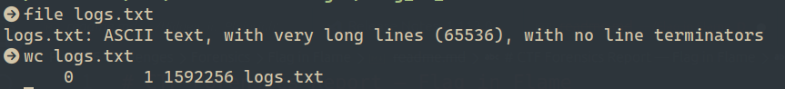
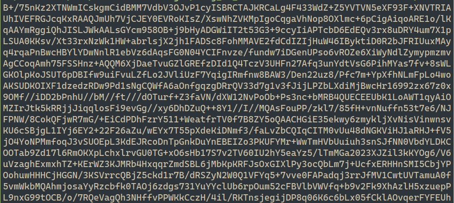
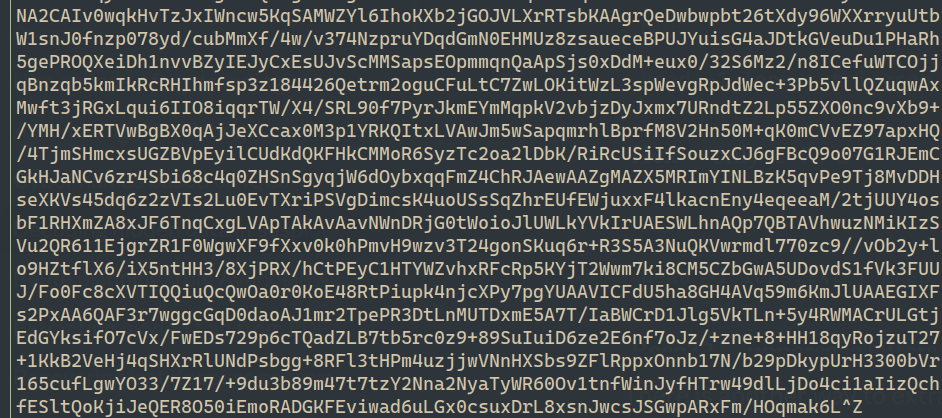
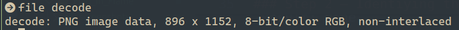
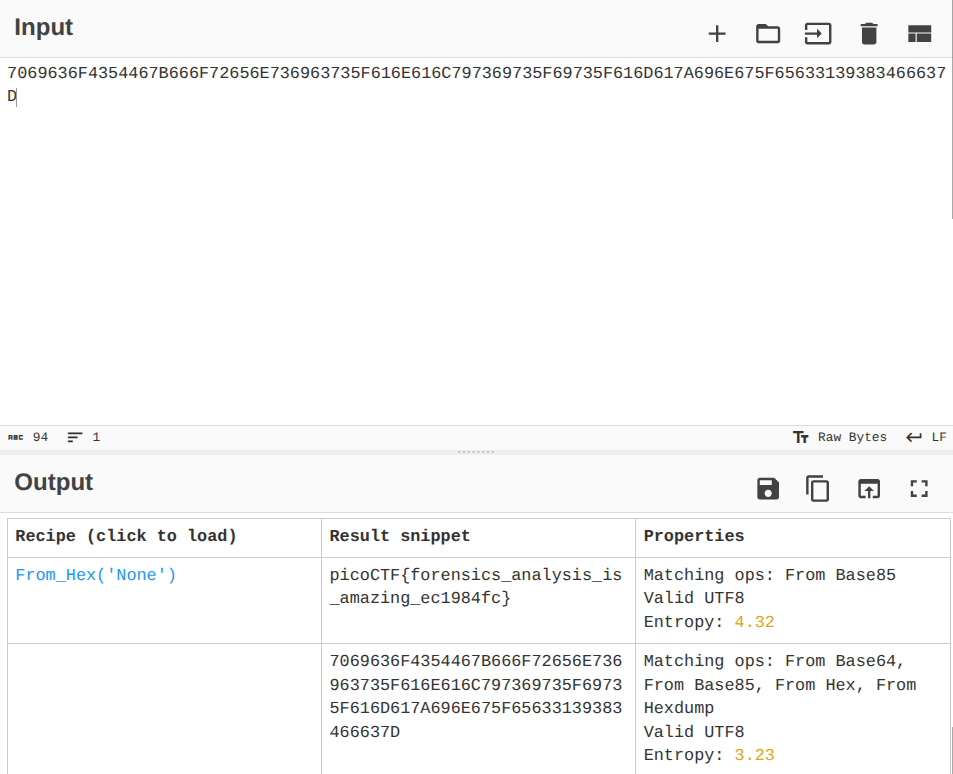

# CTF Forensics Report — Flag in Flame

## Statement
The SOC team discovered a suspiciously large log file after a recent breach. When they opened it, they found an enormous block of encoded text instead of typical logs. Could there be something hidden within? Your mission is to inspect the resulting file and reveal the real purpose of it. The team is relying on your skills to uncover any concealed information within this unusual log.
Download the encoded data here: Logs Data. Be prepared—the file is large, and examining it thoroughly is crucial .

## Challenge Info
- **Name:** Flag in flame
- **Origin:** pico-ctf 
- **Category:** Forensics
- **Date:** 2026-03-25

## Tools Used
-`file`,`wc`,`head`,`base64`,`CyberChef`

## Findings

### Step 1 — Start by understanding what we are dealing with.

- Command: `file logs.txt` and `wc logs.txt`

- Result: After applied these commands, we can see that this is a string file with a lot of characters. Let's 
dig what;s inside with the command below.

- Command: `head -10 logs.txt`

- Result: Enormous block of encoded text. We need to identify the type of encoded has the file.

### Step 2 — Identiying the type of Encoding 

Let's identify the file using two methods Hex(only) or Base64.

- Hex only 0-9, a-f

- Command: `head -1 logs.txt | grep -P '^[0-9a-fA-F]+$'`

-Result: None

- Base64 characters are A-Z, a-z, 0-9, +, /, ends with = or ==

- Command: `head -1 logs.txt | grep -P '^[A-Za-z0-9+/=]+$' `

- Result:

- Conclusion: Base64 Encoded File.

### Step 3 - Decoding the File

After Identifying the type of encoding, proceeds to decode using the following command.

Command: `base64 -d logs.txt > decode`

Result : File called decode, let's check the type of file with the command below.

Command: `file decode`

- Result: After checking the file type, we noticed the file is PNG image file.

- Result: At the botton of the image we can see a long chain of string. let's check out at
step four.

### Step 4 - Checking the String with CyberChef .

- We need to use the CyberChef's Magic recipe in order to get the type.

- Result : After use the Magic recipe we obtain the type  of encoded(Hex encoded) and the flag showed below.

## Flag

`picoCTF{forensics_analysis_is_amazing_ec1984fc7}`

## Conclusion

This challenge demostrate that a file can be hide in another type of file and the message provide in the same can be coded. The same way we need to be carefull with the type if file that we download in ours machine.
