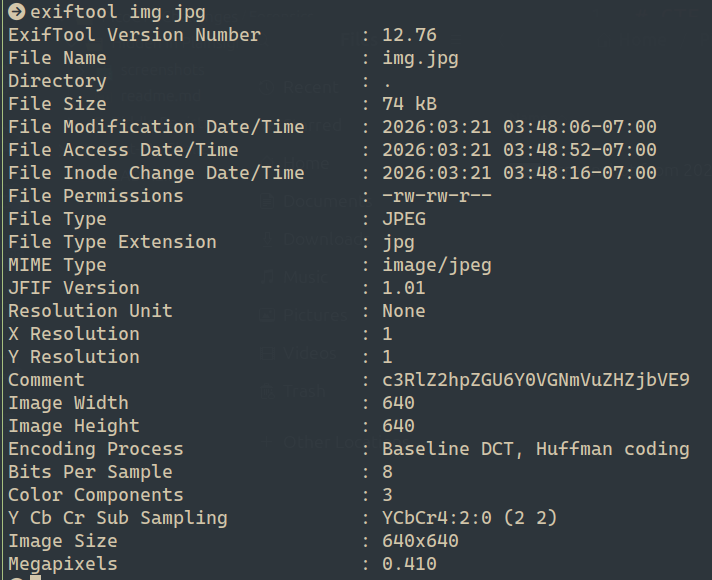

# CTF Forensics Report — Hidden in plainsight

## Statement
You’re given a seemingly ordinary JPG image. Something is tucked away out of sight inside the file. Your task is to discover the hidden payload and extract the flag.

## Challenge Info
- **Name:** Hidden in plainsight
- **Origin:** pico-ctf 
- **Category:** Forensics
- **Date:** 2026-03-21

## Tools Used
-`exiftool`, `CyberChef`

## Findings

### Step 1 — Image JPG Analysis with exiftool
- Command: `exiftool img.jpg`

- Result: The Comment field contained an unusual Base64-encoded string: c3RlZ2hpZGU6Y0VGNmVuZHZjbVE9

### Step 2 — Analysis of the Comment string with CyberCheft 

- Result: Pasted the Comment value into CyberChef and applied From Base64, which decoded the following phrase.

    `steghide:cEF6endvcmQ=`

### Step 3 - Decoding the phrase again with CyberCheft

## Flag
`picoCTF{h1dd3n_1n_1m4g3_e7f5b969}`

## Conclusion
This challenge highlights how document metadata can be weaponized to hide information. 
The PDF's Author field contained a Base64-encoded string — easily missed by a casual viewer 
but trivially extracted with `exiftool`. Decoding it in CyberChef revealed the flag directly. 
A good reminder to always check metadata when analyzing suspicious files in forensics work.

1- Founded with exiftool in the Comment Section: 
    c3RlZ2hpZGU6Y0VGNmVuZHZjbVE9 
2- After decrypt with CyberCheft from Base64 
    steghide:cEF6endvcmQ=

3- After decoding (cEF6endvcmQ=) with CyberChef from Base64
    pAzzword
4- I've executed the following command steghide extract -sf img.jpg and ask for a passphrase and I enter pAzzword and got the flag.

