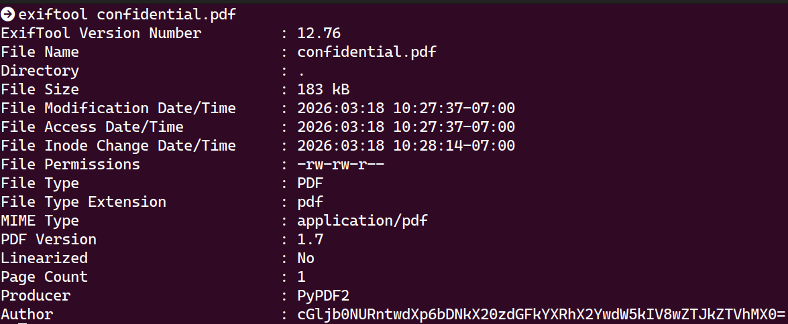
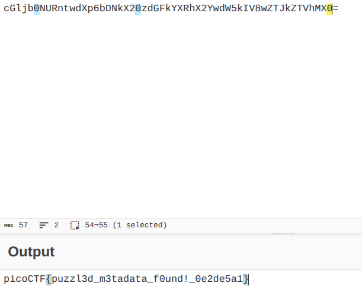

# CTF Forensics Report — Riddle Registry

## Statement
Hi, intrepid investigator! 📄🔍 You've stumbled upon a peculiar PDF filled with what seems like nothing more than garbled nonsense. But beware! Not everything is as it appears. Amidst the chaos lies a hidden treasure—an elusive flag waiting to be uncovered.
Find the PDF file here Hidden Confidential Document and uncover the flag within the metadata.

## Challenge Info
- **Name:** Riddle Registry
- **Origin:** pico-ctf 
- **Category:** Forensics
- **Date:** 2026-03-18

## Tools Used
-`exiftool`, `CyberChef`

## Findings

### Step 1 — PDF Analysis with exiftool
- Command: `exiftool confidential.pdf`

- Result: The Author field contained an unusual Base64-encoded string rather than a real name: cGljb0NURntwdXp6bDNkX20zdGFkYXRhX2YwdW5kIV8wZTJkZTVhMX0=

### Step 2 — Analysis of the Author name with CyberCheft 

- Result: Pasted the Author value into CyberChef and applied From Base64, which decoded to the flag.

## Flag
`picoCTF{puzzl3d_m3tadata_f0und!_0e2de5a1}`

## Conclusion
This challenge highlights how document metadata can be weaponized to hide information. 
The PDF's Author field contained a Base64-encoded string — easily missed by a casual viewer 
but trivially extracted with `exiftool`. Decoding it in CyberChef revealed the flag directly. 
A good reminder to always check metadata when analyzing suspicious files in forensics work.
