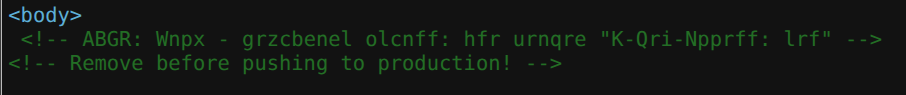
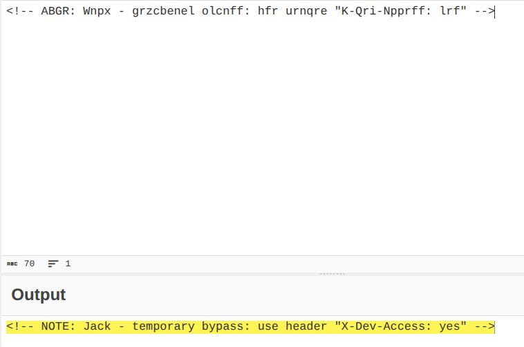

# CTF Web Exploitation Report — Crack the Gate 1

## Statement
We’re in the middle of an investigation. One of our persons of interest, ctf player, is believed to be hiding sensitive data inside a restricted web portal. We’ve uncovered the email address he uses to log in: ctf-player@picoctf.org. Unfortunately, we don’t know the password, and the usual guessing techniques haven’t worked. But something feels off... it’s almost like the developer left a secret way in. Can you figure it out?
Additional details will be available after launching your challenge instance.

## Challenge Info
- **Name:** Crack the Gate 1
- **Origin:** pico-ctf 
- **Category:** Web Exploitation
- **Date:** 2026-03-21

## Tools Used
-`Firefox`, `Python3`, `CyberChef`, `BurpSuit`

## Findings

### Step 1 — Analisys of the WebPage with Firefox

- Result: Pasted the Author value into CyberChef and applied From Base64, which decoded to the flag.

### Step 2 — Analysis of the code with CyberCheft 

- Result: Pasted the Author value into CyberChef and applied From Base64, which decoded to the flag.

## Flag
`picoCTF{puzzl3d_m3tadata_f0und!_0e2de5a1}`

## Conclusion
This challenge highlights how document metadata can be weaponized to hide information. 
The PDF's Author field contained a Base64-encoded string — easily missed by a casual viewer 
but trivially extracted with `exiftool`. Decoding it in CyberChef revealed the flag directly. 
A good reminder to always check metadata when analyzing suspicious files in forensics work.
