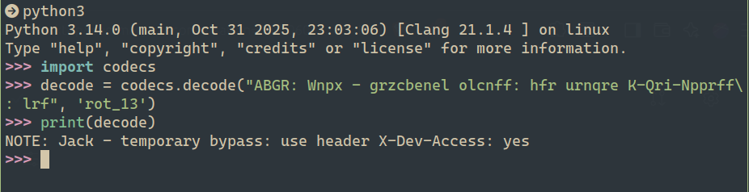
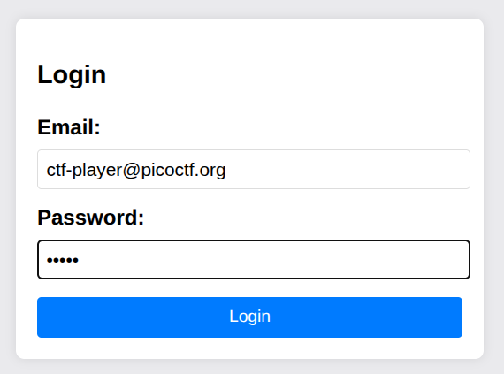
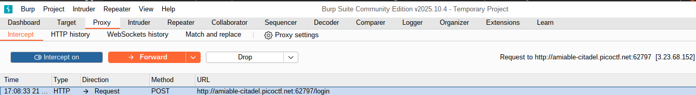
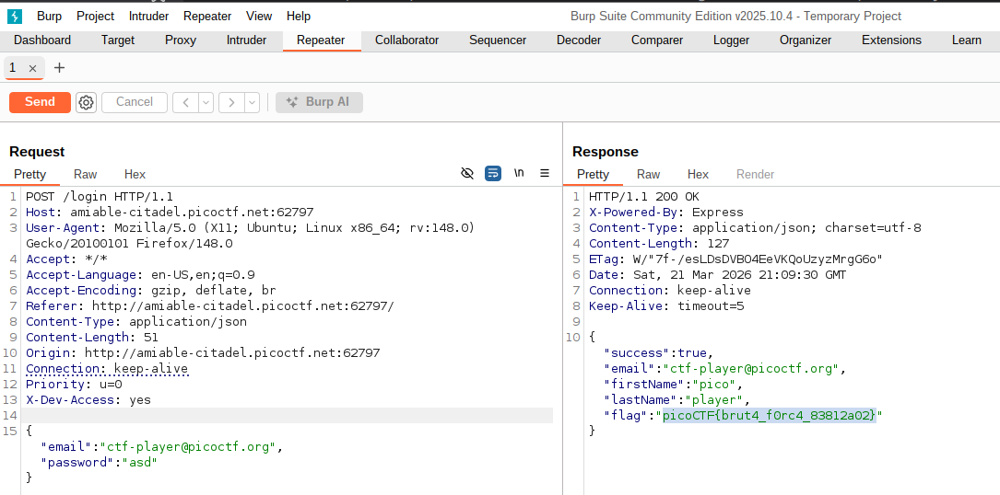

# CTF Web Exploitation Report — Crack the Gate 1

## Statement
We’re in the middle of an investigation. One of our persons of interest, ctf player, is believed to be hiding sensitive data inside a restricted web portal. We’ve uncovered the email address he uses to log in: ctf-player@picoctf.org. Unfortunately, we don’t know the password, and the usual guessing techniques haven’t worked. But something feels off... it’s almost like the developer left a secret way in. Can you figure it out?
Additional details will be available after launching your challenge instance.

## Challenge Info
- **Name:** Crack the Gate 1
- **Origin:** pico-ctf 
- **Category:** Web Exploitation
- **Date:** 2026-03-21

## Tools Used
-`Firefox`, `Python3`, `CyberChef`, `Burp Suit`

## Findings

### Step 1 — Analysis of the HTML Code with Firefox

- Result: Found a ROT13-encoded string left by the developer. 

### Step 2 — Analysis of the phrase with CyberChef 

- Result: After pasting the value, the result was:

    `NOTE: Jack - temporary bypass: use header "X-Dev-Access: yes"`

- We can use the following python code to decrypt any ROT13 phrase:

### Step 3 — Making a request and capture with Burp Suit

- Result: After producing a request and capturing it with Burp Suite: 

- We send the request to the repeater tab for edit the request produced with the header provided in the phrase decrypted.

- After edit the request in the repeated tab adding the following header: "X-Dev-Access: yes" we can send the request to obtain a response and successfull with a HTTP code 200 and providing the following flag.

## Flag
`picoCTF{brut4_f0rc4_83812a02}`

## Conclusion

After solving this challenge we learned that sensitive information left in production code — even when obfuscated with ROT13 — can be discovered through HTML inspection. We also learned how a custom HTTP header (X-Dev-Access: yes) can be used to bypass authentication by editing a captured request in Burp Suite's Repeater tab.
