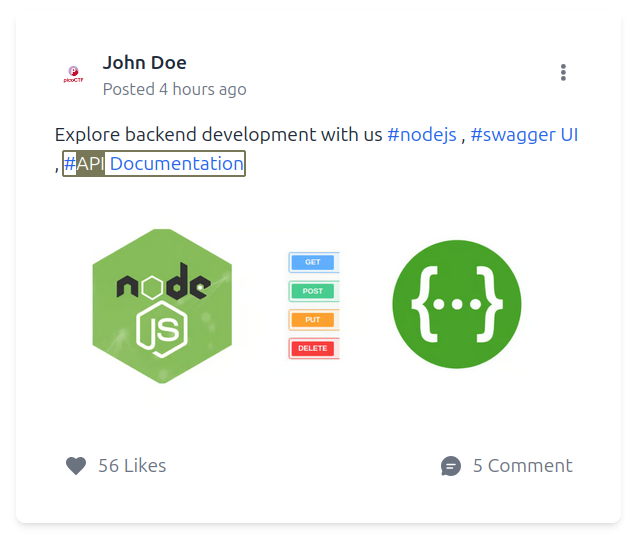
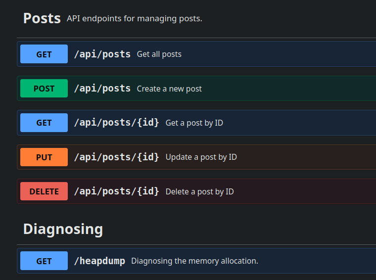
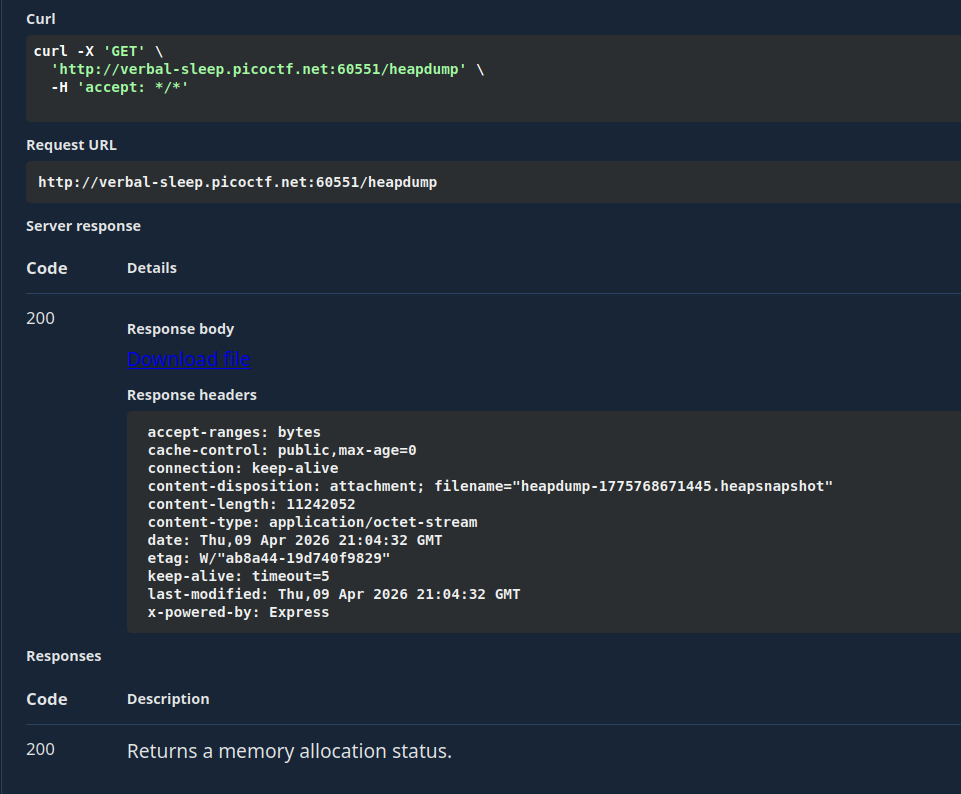
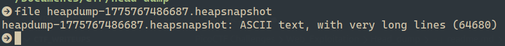
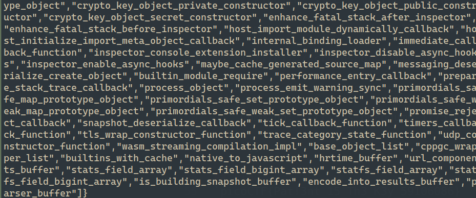
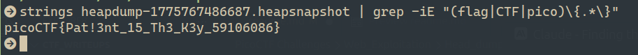

# CTF Web Exploitation Report — Head-dump

## Statement
Welcome to the challenge! In this challenge, you will explore a web application and find an endpoint that exposes a file containing a hidden flag.
The application is a simple blog website where you can read articles about various topics, including an article about API Documentation. Your goal is to explore the application and find the endpoint that generates files holding the server’s memory, where a secret flag is hidden.
Additional details will be available after launching your challenge instance.

## Challenge Info
- **Name:** Head-dump
- **Origin:** pico-ctf 
- **Category:** Web Exploitation
- **Date:** 2026-04-09

## Tools Used
-`Firefox`,`file` ,`strings`w

## Findings

### Step 1 — Recon the Blog Application

    

- After check the web app we can read that there's some article about an API Documentation.

    

### Step 2 — Checking the API Endpoint Documentation

- Later opened the API Documentation we can observe differents methods for use the API and I focus in something particular called `/headdump`.

    

- I proceed to make the request and got the following:

    

- Af file called `heapdump-1775767486687.heapsnapshot` was downloaded, that file is a Node.js/V8 application memory. It captures everything currently living in the Javascript runtime's memory heap.

### Step 3 — Analyzing the file downloaded

- Checking the file with the command: `file`

    Command: `file heapdump-1775767486687.heapsnapshot`

    

- Checking the strings in the file: 

    Command: `strings heapdump-1775767486687.heapsnapshot`

    

### Step 4 — Looking the flag in strings

- Following the instructions of the CTF Statement we supposed that the flag are in the strings, so we need to find them using commands like `strings` and introducing some args like: 

    Command: `strings heapdump-1775767486687.heapsnapshot | grep -iE "(flag|CTF|pico)\{.*\}" `

    

    Explanation of the arguments used in the command.

    - `strings` — extracts all human-readable text from the file
    - `grep -i` — case-sensitive match (matches FLAG, flag, Flag, etc.)
    - `grep -E` — enables extended regex syntax like `|`, `()`, `.*`

    Pattern `"(flag|CTF|pico)\{.*\}"`:
    - `(flag|CTF|pico)` — match any of these three words
    - `\{` — literal opening curly brace `{`
    - `.*` — any character, any amount
    - `\}` — literal closing curly brace `}`

## Flag
`picoCTF{Pat!3nt_15_Th3_K3y_59106086}`

## Conclusion

- After complete this CTF we can analize the importance of not leaving any endpoint opened and vulnerable of our WebApplication. An attacker can access to the V8 heap snapshot of the Backend an obtain valuable information of the project. Because Node.js keeps everything in memory while the app is running including things developers never intended to expose like: API keys, JWT tokens, Database credentials and in this case a hidden flag stored in a variable.

