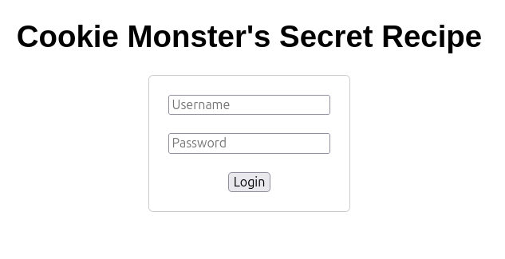
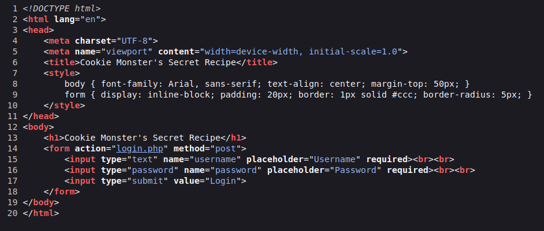
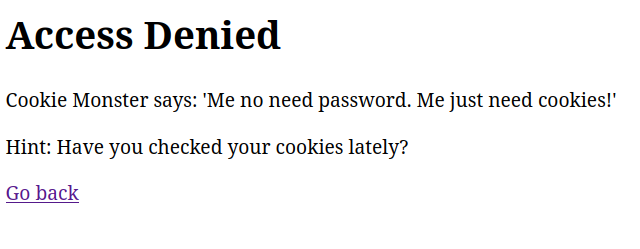
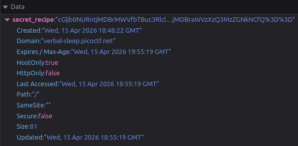
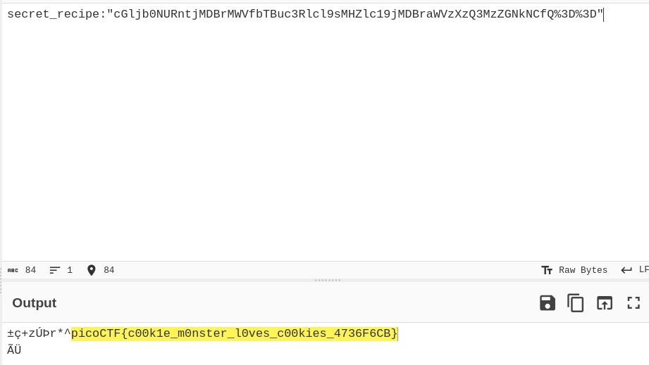

# CTF Web Exploitation Report — Cookie Monster Secret Recipe

## Statement
Cookie Monster has hidden his top-secret cookie recipe somewhere on his website. As an aspiring cookie detective, your mission is to uncover this delectable secret. Can you outsmart Cookie Monster and find the hidden recipe?

## Challenge Info
- **Name:** Cookie Monster Secret Recipe
- **Origin:** pico-ctf 
- **Category:** Web Exploitation
- **Date:** 2026-04-15

## Tools Used
- `Mozilla DevTools`, `CyberChef`

## Findings

### Step 1 — Inspecting the App

- After checking the web app we can observe a login page with an input of username and password.

    

- I proceed to inspect the page source code.

    

### Step 2 — Checking how the website works.

- After checking the source code I didn't find nothing there. I them observed how the website responded.

    

### Step 3 — Analyzing the website cookie generated

- After checking the website message in the login page about cookies, I proced to inspect the cookie.

    

- We can see that in the head of the cookie with parameter `secret_recipe` containing a long Base64-encoded value.

- The next step was check the Base64-encoded value and revise with CyberChef the result was the following:

    

## Flag
`picoCTF{c00k1e_m0nster_l0ves_c00kies_4736F6CB}`

## Conclusion

This challenge highlights the importance of protecting sensitive data on the web. Storing unencrypted or poorly encoded values in client-side cookies — such as Base64 without any additional security layer — exposes applications to trivial data extraction. An attacker with basic browser tools can read, decode, and exploit such values without any server-side interaction. Developers should avoid storing sensitive information in cookies and, when necessary, ensure it is properly encrypted and validated server-side.

