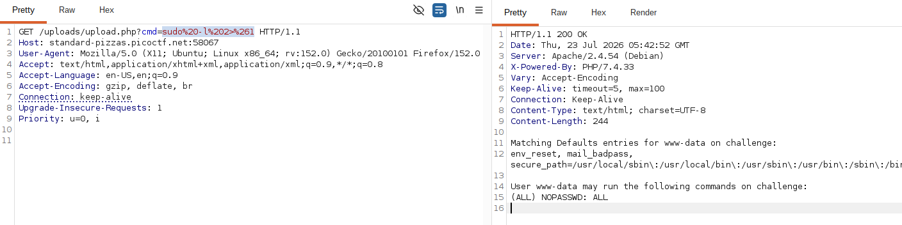
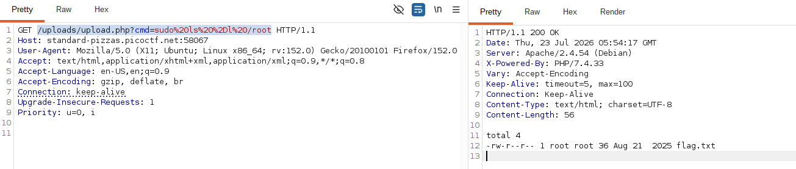

# CTF Web Exploitation Report — n0s4n1ty 1

## Statement
A developer has added profile picture upload functionality to a website. However, the implementation is flawed, and it presents an opportunity for you. Your mission, should you choose to accept it, is to navigate to the provided web page and locate the file upload area. Your ultimate goal is to find the hidden flag located in the /root directory.

## Challenge Info
- **Name:** n0s4n1ty 1
- **Origin:** CyLab Academy 
- **Category:** Web Exploitation
- **Date:** 2026-07-19  

## Tools Used
- `Mozilla`, `BurpSuit`, `CyberChef`

## Findings

### Step 1 — Inspecting the Web

- After checking the web app we can observe  profile with an upload profile button.

    

### Step 2 — Testing what the server actually validates.

- I'll try to upload a .php file with a trivial payload

     

- After upload the file, the server responds with the following answer:

   

- Meaning that we have a RCE(Remote Code Execution) and now we have to find the flag.

### Step 3 — Checking what the server respond to try to find the flag.

- Testing the following command: `?cmd=sudo%20-l%202>%261` `(Decoded: sudo -l 2>&1)`

    

- After getting the result of the command means that we can run any command as root, no password needed. That's our scalation path.

### Step 4 — Checking for the flag in the root directory

- Executing the following command into the url with Burp to check if the /root directory is empty.
        `/uploads/upload.php?cmd=sudo%20ls%20%2Dl%20/root`
    
    

- Executing the command to read the flag: 
    `/uploads/upload.php?cmd=sudo%20cat%20/root/flag%2Etxt`

    

## Flag
`picoCTF{wh47_c4n_u_d0_wPHP_5fd11be6}`

## Conclusion

This CTF demostrate a complete explotation chain from an insecure file upload feature to full root-level compromise of the target system.

