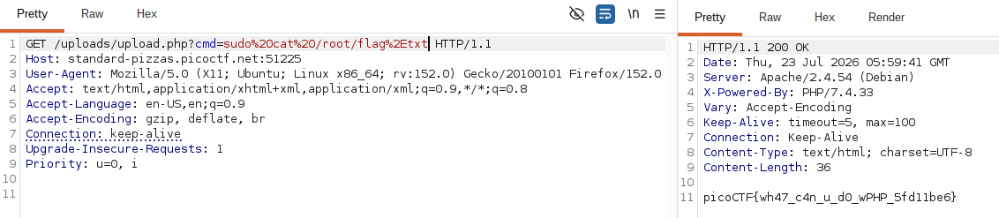

# CTF Web Exploitation Report — n0s4n1ty 1

## Statement
A developer has added profile picture upload functionality to a website. However, the implementation is flawed, and it presents an opportunity for you. Your mission, should you choose to accept it, is to navigate to the provided web page and locate the file upload area. Your ultimate goal is to find the hidden flag located in the /root directory.

## Challenge Info
- **Name:** n0s4n1ty 1
- **Origin:** CyLab Academy 
- **Category:** Web Exploitation
- **Date:** 2026-07-19  

## Tools Used
- `Mozilla DevTools`, `CyberChef`

## Findings

### Step 1 — Inspecting the App

- After checking the web app we can observe a login page with an input of username and password.

    

- I proceed to inspect the page source code.

    

### Step 2 — Checking how the website works.

- After checking the source code I didn't find nothing there. I them observed how the website responded.

    

### Step 3 — Analyzing the website cookie generated

- After checking the website message in the login page about cookies, I proced to inspect the cookie.

    

- We can see that in the head of the cookie with parameter `secret_recipe` containing a long Base64-encoded value.

- The next step was check the Base64-encoded value and revise with CyberChef the result was the following:

    

## Flag
`picoCTF{c00k1e_m0nster_l0ves_c00kies_4736F6CB}`

## Conclusion

This challenge highlights the importance of protecting sensitive data on the web. Storing unencrypted or poorly encoded values in client-side cookies — such as Base64 without any additional security layer — exposes applications to trivial data extraction. An attacker with basic browser tools can read, decode, and exploit such values without any server-side interaction. Developers should avoid storing sensitive information in cookies and, when necessary, ensure it is properly encrypted and validated server-side.

