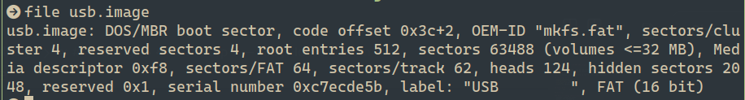
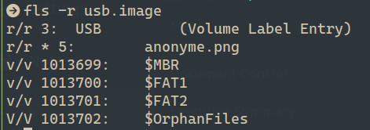
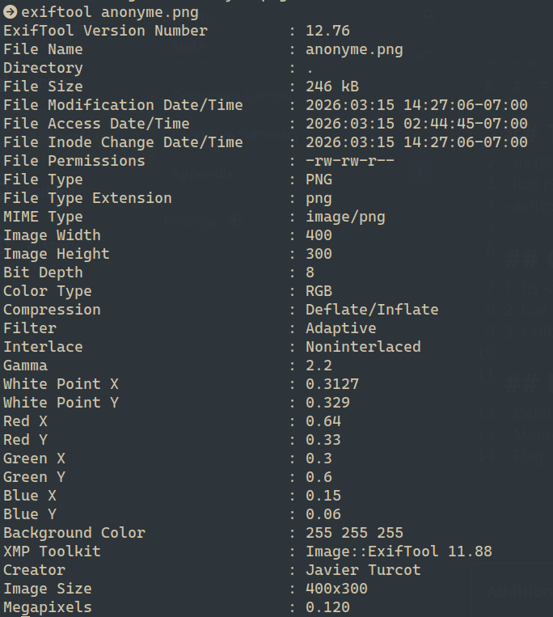

# CTF Forensics Report — USB Challenge

## Statement
Your cousin found a USB drive in the library this morning. He’s not very good with computers, so he’s hoping you can find the owner of this stick!

The flag is the owner’s identity in the form firstname_lastname

## Challenge Info
- **Name:** Delete File
- **Origin:** root-me.org 
- **Category:** Forensics
- **Date:** 2026-03-15

## Tools Used
- `fls`, `icat`, `exiftool`

## Findings

### Step 1 — Image Identification
- Command: `file usb.image`

- Result: FAT filesystem

### Step 2 — File Listing
- Command: `fls -r usb.image`

- Found deleted file: `anonyme.png` (inode 5)

### Step 3 — File Recovery
- Command: `icat usb.image 5 > anonyme.png`
- Result: PNG recovered successfully

### Step 4 — Metadata Analysis
- Command: `exiftool anonyme.png`

## Flag
`javier_turcot`

## Conclusion
The USB drive owner was identified by recovering the deleted file 
`anonyme.png` (inode 5) using `icat` and analyzing its metadata 
with `exiftool`. The `Creator` field revealed the owner's full name.
