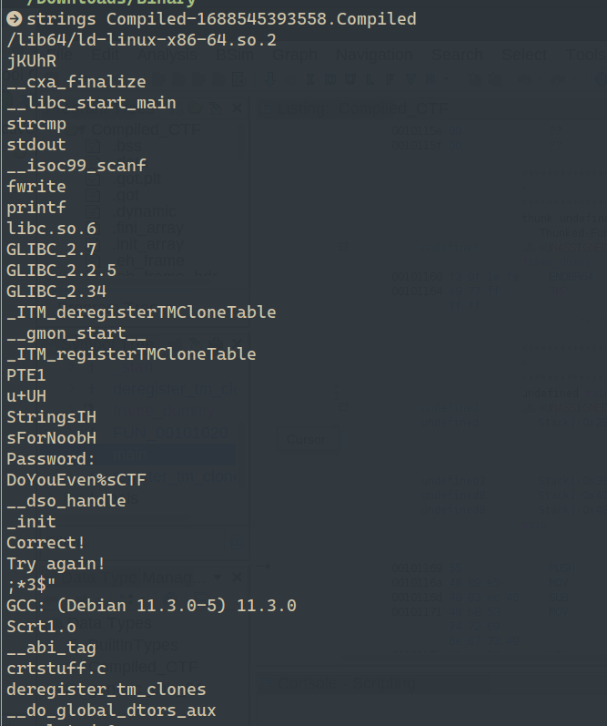
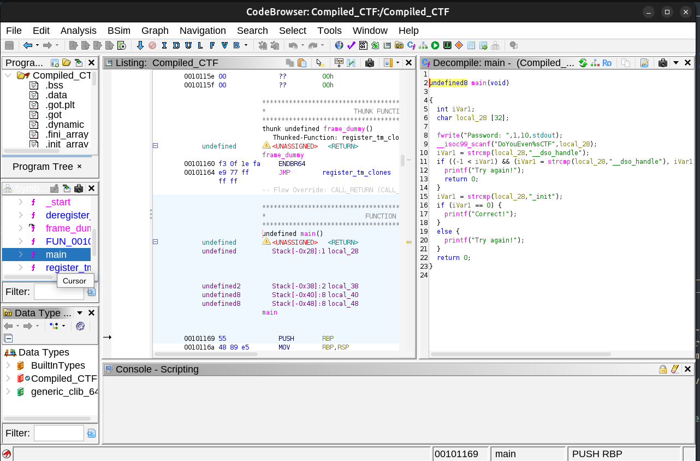

# CTF Purple Team Report — Compiled

## Hint

Strings can only help you so far.

## Statement

Download the task file and get started. The binary can also be found in the AttackBox inside the /root/Rooms/Compiled/ directory.

Note: The binary will not execute if using the AttackBox. However, you can still solve the challenge.

## Challenge Info
- **Name:** Compiled
- **Origin:** Tryhackme 
- **Category:** Purple Team
- **Date:** 2026-04-01

## Tools Used
-`file`, `strings`, `GHidra`

## Findings

### Step 1 — Analysis of the filename with `file` command

- After downloaded the filename `Compiled-1688545393558.Compiled`

    

- We proceed to analize the file with the linux command `file`

- Command: `file Compiled-1688545393558.Compiled`  

- Result: 

    

### Step 2 — Strings analisys of the file

- After analize the type of the file we proceeds to check all string in the file.

- Command: `strings Compiled-1688545393558.Compiled` part of the result I'll show bellow.

### Step 3 — Ghidra analisys of the file 

- Proceding to open the file with GHidra and goind directly to the _main function to inspect the code.

- Result: 

- After analyzing the binary the logic revealed that the program prompts Password and read the input using `scanf(“DoYouEven%sCTF”, local_28)`meaning the input must be prefixed with DoYouEven and suffixed with CTF. Since scanf expects DoYouEven%sCTF, the raw input must be DoYouEven_init to form DoYouEven_init

## Flag

`DoYouEven_init`

    

