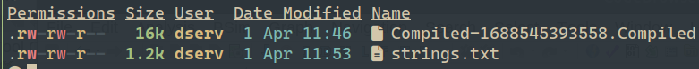
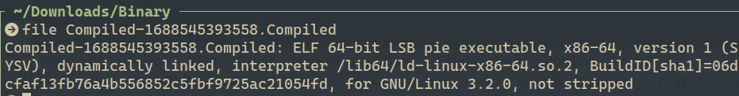

# CTF Purple Team Report — Compiled

## Hint

Strings can only help you so far.

## Statement

Download the task file and get started. The binary can also be found in the AttackBox inside the /root/Rooms/Compiled/ directory.

Note: The binary will not execute if using the AttackBox. However, you can still solve the challenge.

## Challenge Info
- **Name:** Compiled
- **Origin:** Tryhackme 
- **Category:** Purple Team
- **Date:** 2026-04-01

## Tools Used
-`file`, `strings`, `GHidra`

## Findings

### Step 1 — Analysis of the filename with `file` command

- After downloaded the filename `Compiled-1688545393558.Compiled`

    

- We proceed to analize the file with the linux command `file`

- Command: `file Compiled-1688545393558.Compiled`  

- Result: 

    

### Step 2 — Strings analisys of the file

### Step 3 — Ghidra analisys of the file 

### Step 4 — Password Obtained.

## Flag

`DoYouEven_init`

## Conclusion

    

