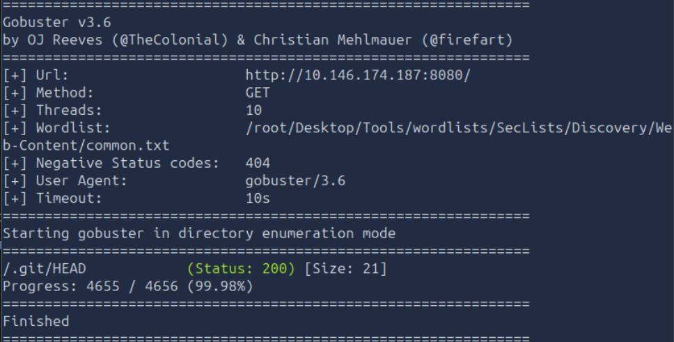
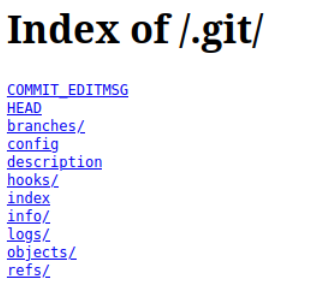
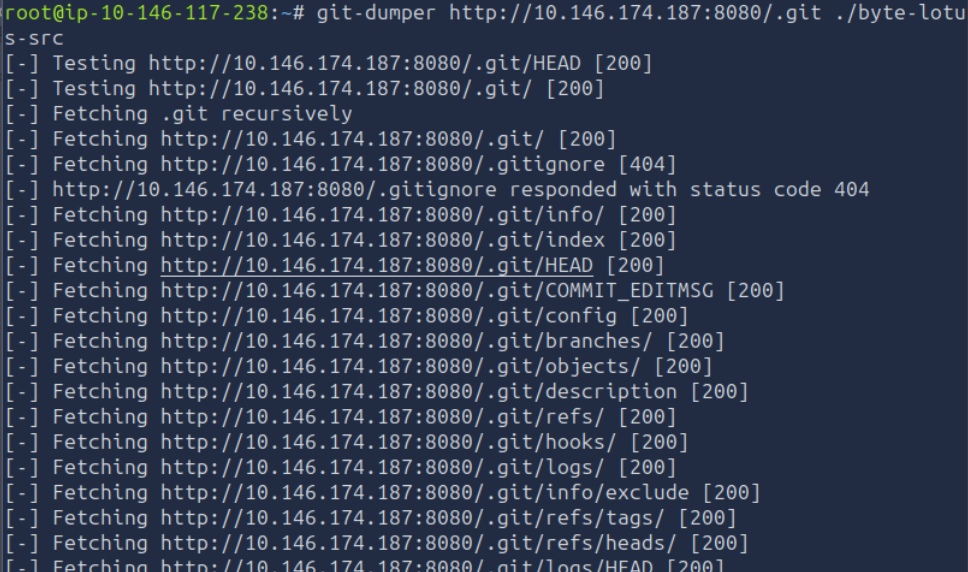
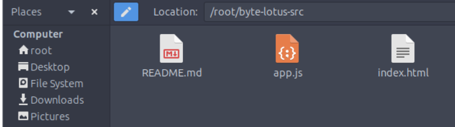
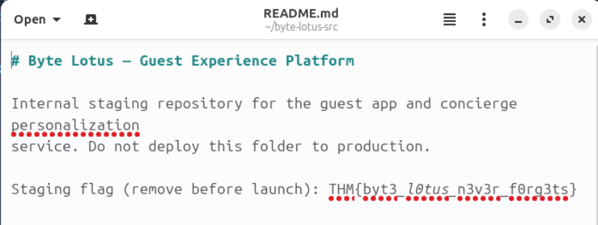

# Hacker Holidays — Rom 404

## Hint

Dump the exposed source code.
 
Find the flag

## Statement

He booked the quiet room. It's not on the floor plan, not in the brochure, not on any door. But port 8080 is wide open, and the rooms it never lists are the ones worth finding.

Welcome to the Byte Lotus, where the WiFi is open, the app is free, and the concierge already knows your coffee order. You spend these first days as a guest who simply notices things — a room that isn't on the floor plan, packets that leave every night at the same hour, a profile assembled from two breakfasts and a livestream.

The Byte Lotus guest-experience platform went live in a hurry, and the night-shift developer shipped more than the website.

## Challenge Info
- **Name:** Rom 404
- **Origin:** Tryhackme 
- **Category:** Red Team
- **Date:** 07-28-2026

## Tools Used
-`gobuster`, `gitdump`, `texteditor`

## Findings

### Step 1 — Analisys of the Lab Machine.

- After the lab machine loaded and opened the address provided `http://10.144.176.255:8080`

    

- I've observe non secure webpage. 

    

### Step 2 — Enumerating the directory to find exposed endpoints.

- Applying the following command to inspect the website.

- Command: `gobuster dir -u http://10.146.174.187:8080/ -w /root/Desktop/Tools/wordlists/SecLists/Discovery/Web-Content/common.txt` part of the result I'll show bellow.

    

### Step 3 — Analysing the endpoint founded. 

- After checking the endpoint exposed means that the whole .git object database is likely reached too.
    This is our entry point.

- Verifying it's a readable directory with the following curl command:

    `curl http://10.144.176.255:8080/.git/HEAD` 

- After applying the command we get the following result: 

    `ref: refs/heads/main` Meaning that the objects, refs, and logs are almost certainly fetchable too.

### Step 4 — Dumping the full repo with `git-dumper`.

- Installing the python script:  `pip install git-dumper --break-system-packages`

- Applying the command to dumpt the repo: 

    `git-dumper http://10.144.176.255:8080/.git ./byte-lotus-src`

    

- After dumping the repo we found the app 

    

- Inspecting the Readme file: 

    

### Flag `THM{byt3_l0tus_n3v3r_f0rg3ts}`

    

