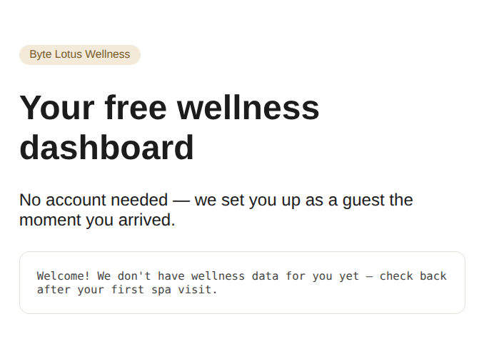
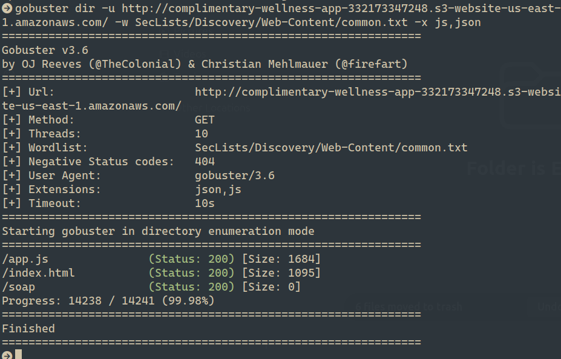
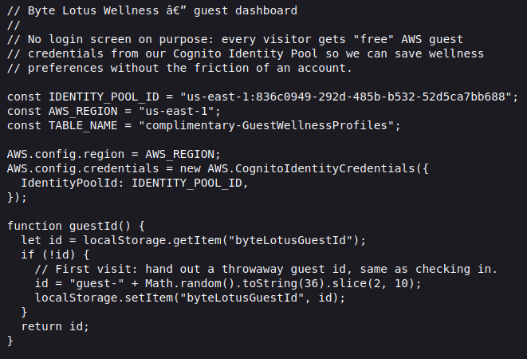
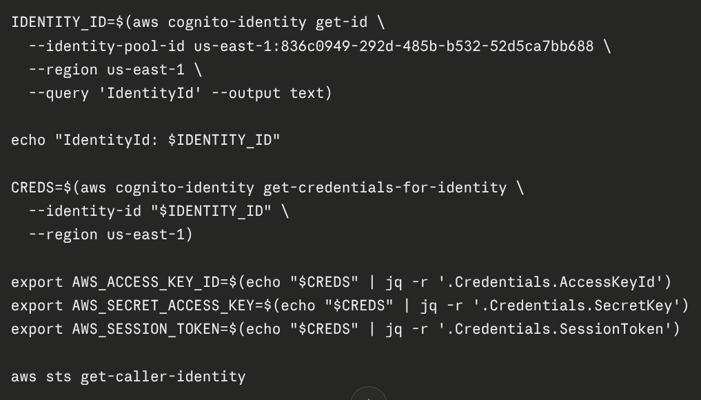
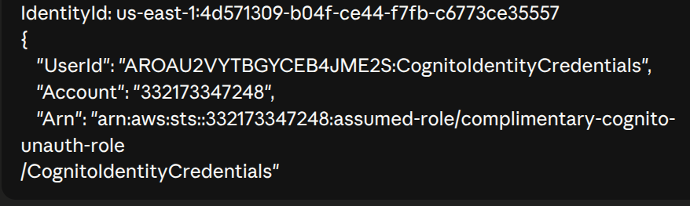
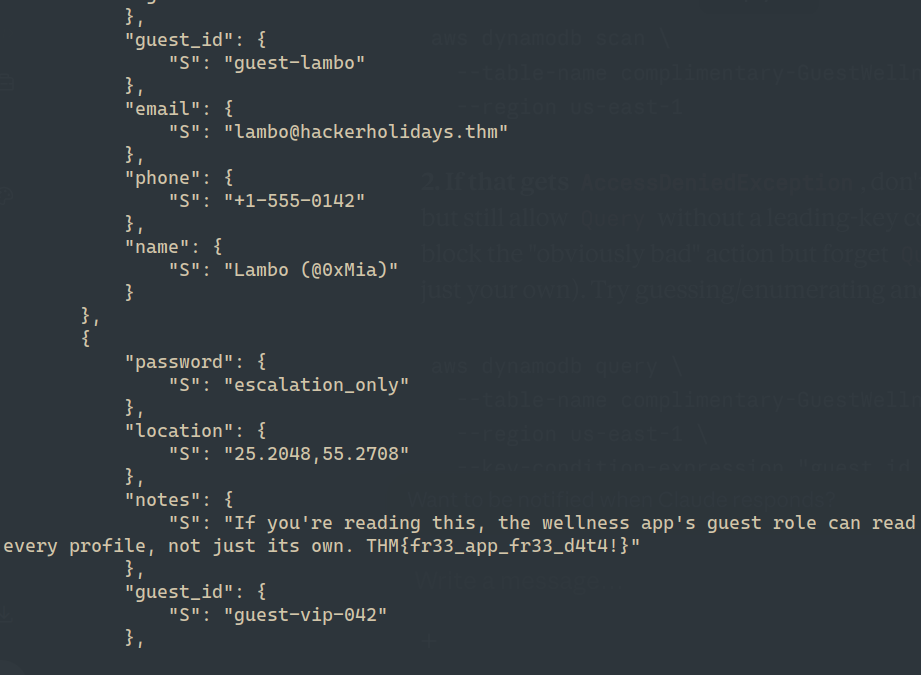

# Hacker Holidays — Complimentary

## Hint

Track down the AWS mechanism issuing you credentials behind the scenes.
 
Use those credentials to dump more than your own record from the app's DynamoDB table.
 
Retrieve the flag from another guest's data.

## Statement

Concierge Briefing
Lambo installed the Byte Lotus Wellness app the day she arrived — it was free, it had great reviews (written by the app, but she didn't check), and it got her a tote bag for saying yes to camera, mic, contacts, and location access. No account needed. No login screen. It just… knows things about you the moment you open it.

That's the whole pitch: “complimentary” access, no friction, no sign-up. Something still has to be deciding what you're allowed to see, even without a login — and whatever that something is, it isn't checking very carefully.

Your objective: find out how the app knows anything about you at all, and see what else it's willing to hand over.

## Challenge Info
- **Name:** Complimentary
- **Origin:** Tryhackme 
- **Category:** Red Team
- **Date:** 07-29-2026

## Tools Used
-`gobuster`, `awscli`, `texteditor`, `jq`

## Findings

### Step 1 — Analisys of the room access.

- The CTF provide a room access link `http://complimentary-wellness-app-332173347248.s3-website-us-east-1.amazonaws.com/`

    

- After check the website I've start the enumeration process using gobuster and using the following command: 

    `gobuster dir -u http://complimentary-wellness-app-332173347248.s3-website-us-east-1.amazonaws.com/ -w SecLists/Discovery/Web-Content/common.txt `

    

- After checking all directories and files founded by gobuster. We obtain a *.js file called app.js that containt everything that we need to get the data, like Identity Pool ID, table and key schema of the table. 

    

### Step 2 — Using `jq` to avoid copy/paste lag and get the credentials to login.

- Installing `jq(Command Line Json Processor)` using the following command: 

    `sudo apt install jq `

- After `jq` installed we use the following whole command block so there's no windows for the token to expire between steps that's what we are using this tool.

    

- We use `--identity-pool-id us-east-1:836c0949-292d-485b-b532-52d5ca7bb688 ` founded in `js` file to get authenticate in the system.

### Step 3 — Checking the authentication type.

- After being applied the before commands we need to know if we get authenticate in the system with the command belows:

    `aws sts get-caller-identity`

- Response: 
    
    

- Confirmed, we are authenticated as `complimentary-cognito-unauth-role`. 
    
### Step 4 — Scanning the directory.

- Scanning the directory using the following command: 

    `aws dynamodb scan \
        --table-name complimentary-GuestWellnessProfiles \
        --region us-east-1`

- Result: 
    
    

- After getting the result we found the flag in the directory.

### Flag `THM{fr33_app_fr33_d4t4!}`

    

