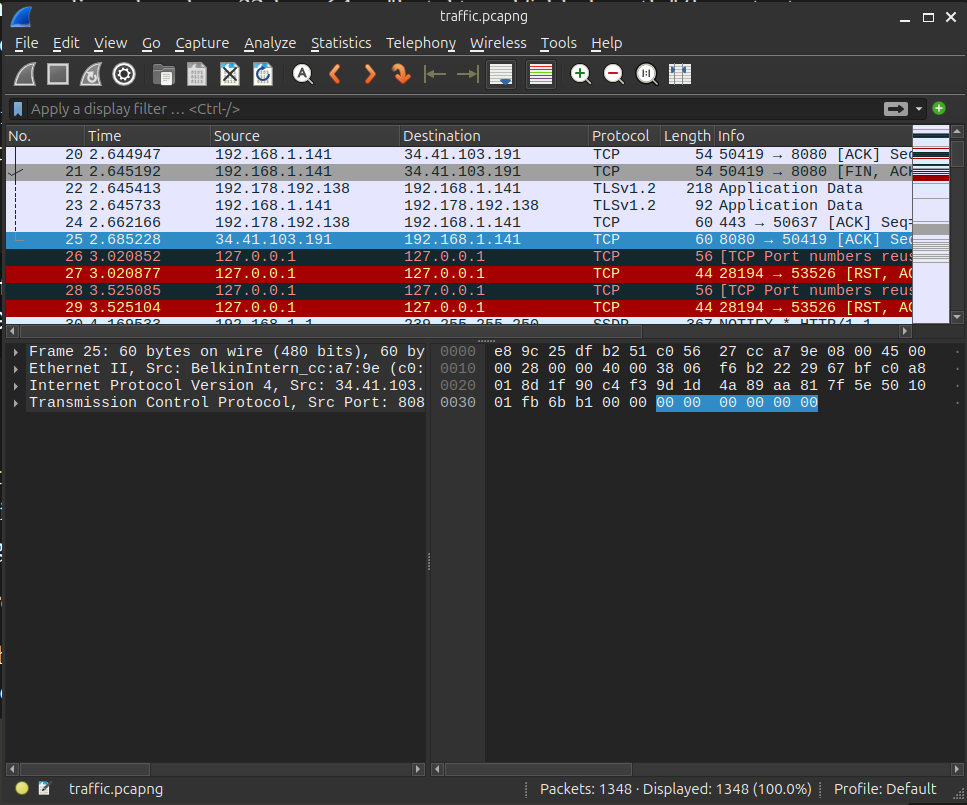
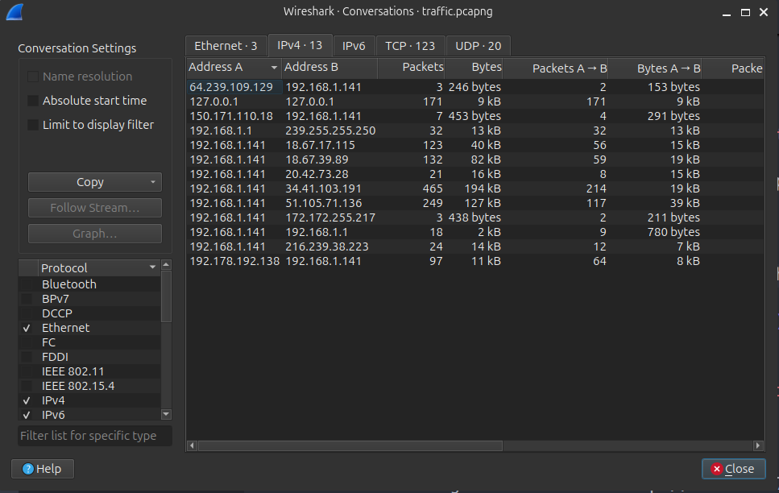
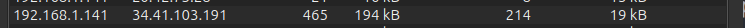
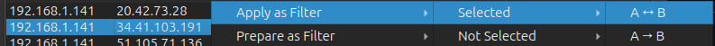
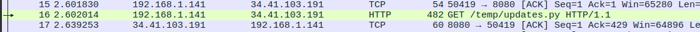
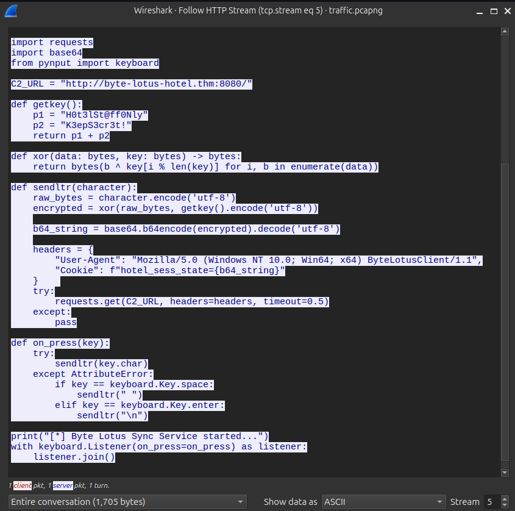
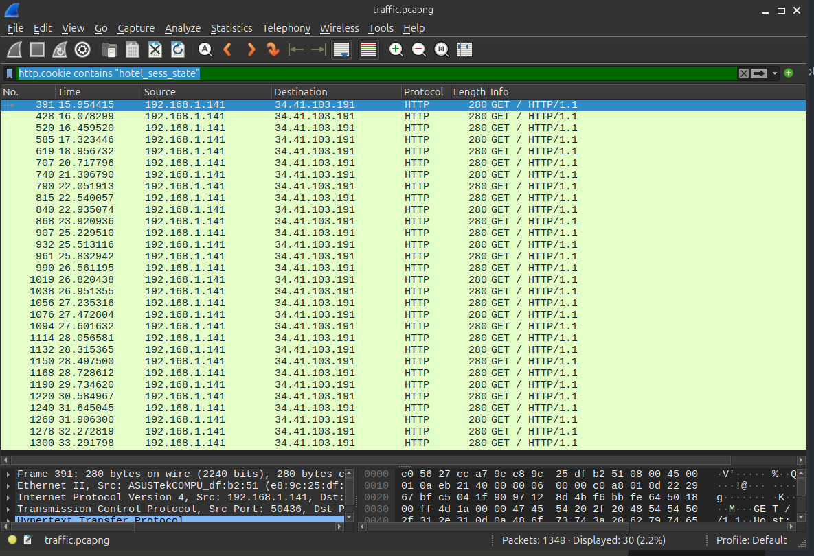
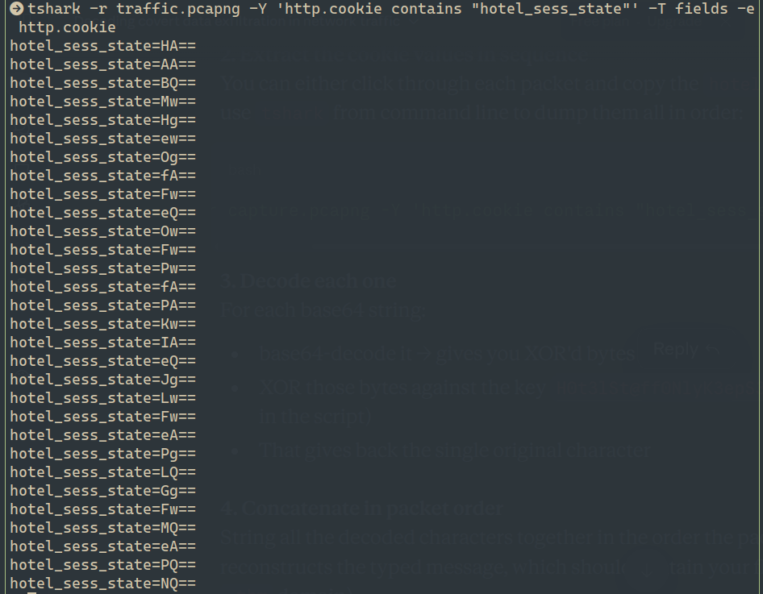

# Hacker Holidays — Packet Light

## Hint

Analyze the provided capture for a covert communication channel.
Identify where the exfiltrated data is being hidden and reassemble it.
Decode the recovered data and submit the flag.

## Statement

Tiny packets. Odd hours. Suspiciously regular. Someone's smuggling out the data equivalent of a hotel towel every night, folded neatly inside traffic that looks ordinary until you decode it.

A short capture from the guest network is all VERA could pull before the connection dropped. Somewhere in that traffic, a quiet little errand is running on a loop, and it isn't part of any service the hotel actually offers.

## Challenge Info
- **Name:** Packet Light
- **Origin:** Tryhackme 
- **Category:** Forencics
- **Date:** 07-30-2026

## Tools Used
-`wireshark`, `t-shark`, ``

## Findings

### Step 1 — Opening and checking the packet file.

- After being downloaded the file `traffic.pcapng`, I've opened with wireshark to analize the file.

    

- After opened the file. I start to check the conversations.  

    

### Step 2 — Checking the most insterested conversation.

- After checking the conversations the most interesting was based in the number of packets sent between thems.

    

- I've applied a filter to see all the conversation between this two IP's.

    

- After checking the conversations. I've founded a file called `updates.py`.

    

### Step 3 — Checking the stream of the pytho file. 

- I've decided to open the stream of the file and read the file.

    

- This is a keylogger: every keystroke gets XOR'd with "H0t3lSt@ff0NlyK3epS3cr3t!", base64-encoded, and smuggled out one character at a time in the Cookie: hotel_sess_state=... header on requests to byte-lotus-hotel.thm:8080

### Step 4 — Filtering the cookie in Wireshark.

- I've utilized the following query to filter about the cookie: 

    `http.cookie contains "hotel_sess_state"` and got the result below: 

    

### Step 5 — Extracting the cookies values in sequence.

- After checking the cookie packets, I can use tshark from command to dump them all in order, using the following command: 

    `tshark -r capture.pcapng -Y 'http.cookie contains "hotel_sess_state"' -T fields -e http.cookie`

    

- After decode each one for each base64 string . I've sort those bytes agains the secret key (H0t3lSt@ff0NlyK3epS3cr3t!) and getting the flag : `THM{V3r4_1s_w4tch1ng_0veR_y0u}`

### Flag THM{V3r4_1s_w4tch1ng_0veR_y0u}

