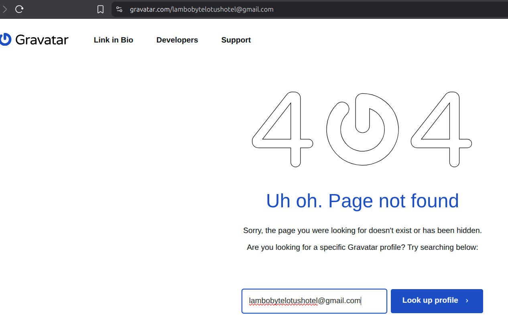
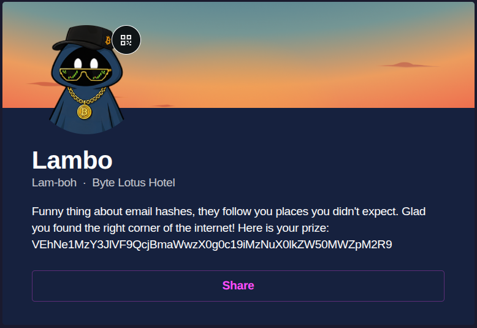
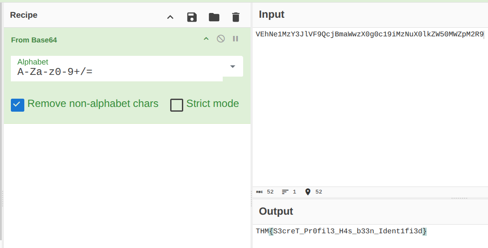

# Hacker Holidays — Overheard at Breakfast

## Hint

Analyze the provided conversation for identifying details
 
Extract the relevant clues
 
Locate the hidden account
 
Submit the flag

## Statement

The breakfast terrace is loud this morning, clinking cutlery, espresso machines, the usual chatter. One guest couldn't help but linger at a nearby table, seeing more of a conversation than they were meant to.

When the table's occupant stepped away for a refill, they seized the moment and grabbed a screenshot before it could disappear. Somewhere in that conversation is enough to track down an account nobody was supposed to find.

## Challenge Info
- **Name:** Overheard at Breakfast
- **Origin:** Tryhackme 
- **Category:** OSINT
- **Date:** 08-11-2026

## Tools Used
-`google`, `nc`, ``

## Findings

### Step 1 — Analizing the conversation. 

- After extracting the conversation below 

    
 
### Step 2 — Identifiying details of the screenshot .

- A tool "started with a G" that let him link a profile picture and other accounts, which he "wiped."
- I've use google to find information about that tool and it's called: 

    `https://gravatar.com/`

- In the conversation he offer an email to contact him: `lambobytelotushotel@gmail.com`

- I've opened the website and enter into the address the email to get his profile, but instead of that I got a 404 web page that helpme to find his profile entering the email provided.

    

### Step 3 — Getting the flag.

- So after identify the profile of Lambo we can see base64 string:

    

- Converting the base64 string with CyberChef: 

    

### Flag: THM{S3creT_Pr0fil3_H4s_b33n_Ident1fi3d}

