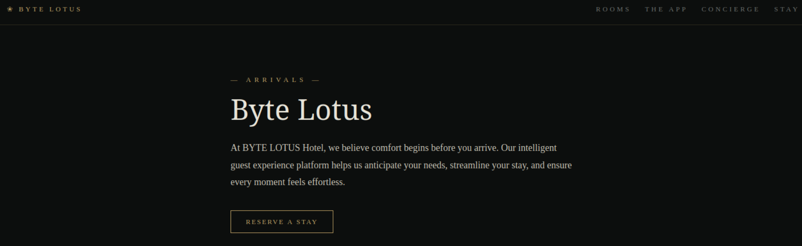

# Hacker Holidays — Rom 404

## Hint

Dump the exposed source code.
 
Find the flag

## Statement

He booked the quiet room. It's not on the floor plan, not in the brochure, not on any door. But port 8080 is wide open, and the rooms it never lists are the ones worth finding.

Welcome to the Byte Lotus, where the WiFi is open, the app is free, and the concierge already knows your coffee order. You spend these first days as a guest who simply notices things — a room that isn't on the floor plan, packets that leave every night at the same hour, a profile assembled from two breakfasts and a livestream.

The Byte Lotus guest-experience platform went live in a hurry, and the night-shift developer shipped more than the website.

## Challenge Info
- **Name:** Rom 404
- **Origin:** Tryhackme 
- **Category:** Red Team
- **Date:** 07-28-2026

## Tools Used
-`gobuster`, `gitdump`, `texteditor`

## Findings

### Step 1 — Analisys of the Lab Machine.

- After the lab machine loaded and opened the address provided `http://10.144.176.255:8080`

    

- I've observe non secure webpage. 

    

### Step 2 — Strings analisys of the file

- After analize the type of the file we proceeds to check all string in the file.

- Command: `strings Compiled-1688545393558.Compiled` part of the result I'll show bellow.

### Step 3 — Ghidra analisys of the file 

- Proceding to open the file with GHidra and goind directly to the _main function to inspect the code.

- Result: 

- After analyzing the binary the logic revealed that the program prompts Password and read the input using `scanf(“DoYouEven%sCTF”, local_28)`meaning the input must be prefixed with DoYouEven and suffixed with CTF. Since scanf expects DoYouEven%sCTF, the raw input must be DoYouEven_init to form DoYouEven_init

## Flag

`DoYouEven_init`

    

